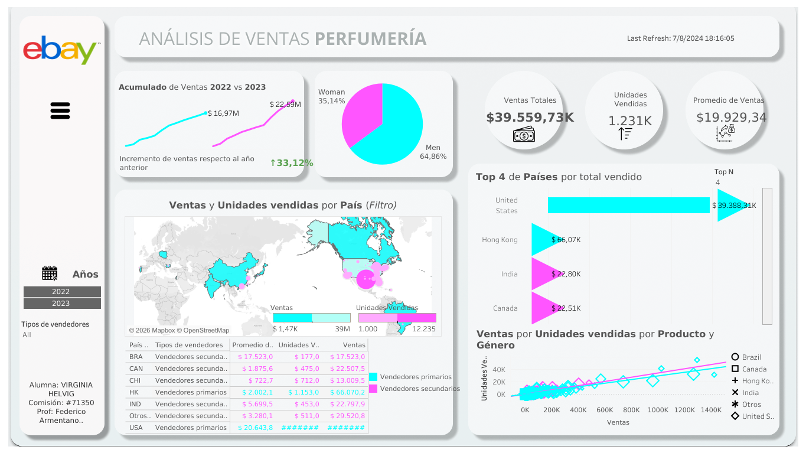
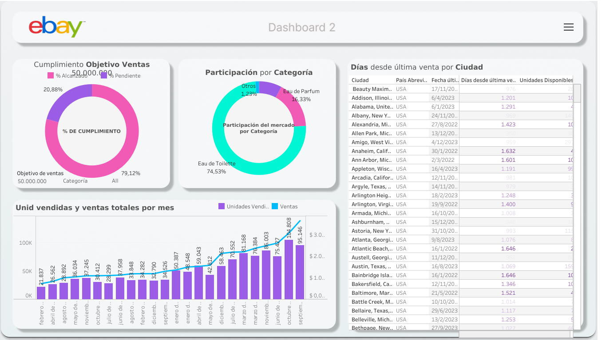
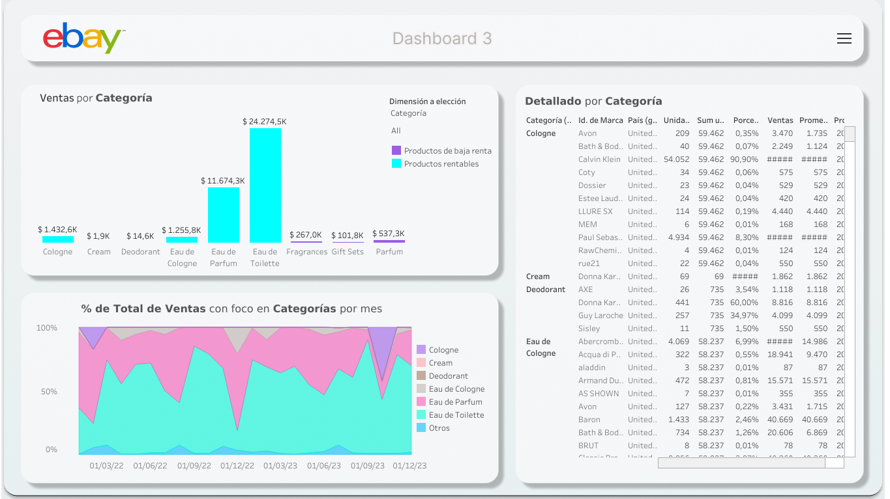
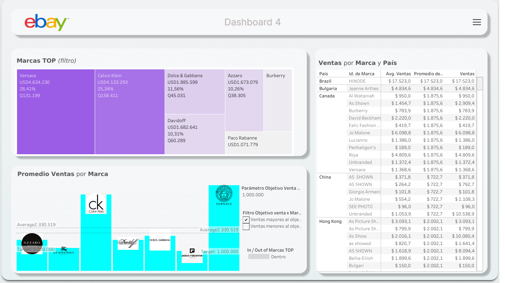
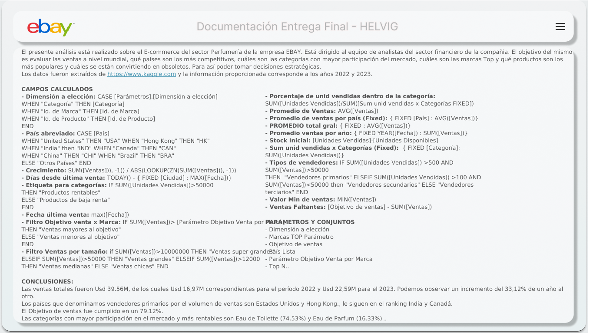

# 🧴 Análisis de Ventas de Perfumes en eBay

Dashboard interactivo en Tableau que analiza las ventas globales de perfumería en eBay durante 2022-2023, orientado a un equipo de analistas del sector financiero que necesita tomar decisiones estratégicas sobre mercados, categorías y marcas.

🔗 **[Ver dashboard en vivo en Tableau Public](https://public.tableau.com/app/profile/virginia.elizabeth.helvig/viz/EntregaFinal-Helvig/Dashboard1)**

---

## 🎯 Objetivo del análisis

Evaluar el desempeño de ventas a nivel mundial del sector Perfumería de eBay para responder:

- ¿Qué países son los más competitivos?
- ¿Qué categorías tienen mayor participación de mercado?
- ¿Cuáles son las marcas top?
- ¿Qué productos son populares y cuáles se están volviendo obsoletos?
- ¿Estamos cumpliendo el objetivo de ventas definido?

## 📊 Los datos

- **Fuente**: [Kaggle](https://www.kaggle.com)
- **Período**: 2022-2023
- **Volumen**: 1.985 registros de venta, 13 columnas (marca, producto, categoría, género, precio unitario, unidades disponibles/vendidas, ventas, fecha, ciudad, país)
- **Calidad**: sin valores nulos ni filas duplicadas

## 🛠️ Herramientas

Tableau Desktop / Tableau Public · Excel (fuente de datos)

## 🔍 Proceso

1. **Definición del objetivo de negocio** antes de tocar los datos: quién es el usuario del dashboard (analistas financieros) y qué decisiones necesita tomar.
2. **Preparación y limpieza de datos** en Excel antes de conectar la fuente a Tableau: verificación de tipos de dato y consistencia de campos.
3. **Campos calculados propios**, pensados para agregar valor analítico más allá de agregaciones simples:
   - `Tipos de vendedores`: clasifica países en *primarios / secundarios / terciarios* combinando volumen de unidades vendidas y facturación (lógica tipo ABC), en vez de rankear por un solo criterio.
   - `Ventas Faltantes`: mide la brecha entre las ventas acumuladas y un objetivo de ventas de USD 50.000.000, alimentando un gauge de cumplimiento de meta.
   - `Dimensión a elección` (parámetro): permite pivotear una misma vista entre Categoría / Marca / Producto sin duplicar hojas.
   - `Filtro Objetivo venta x Marca` (parámetro editable): el usuario define un umbral de ventas por marca y el dashboard resalta en tiempo real qué marcas lo superan — funciona como una herramienta de simulación, no solo de reporte.
   - Agrupaciones (`Categoría (grupo)`, `País (grupo)`): consolidan valores de baja frecuencia en "Otros" para no saturar los gráficos.
4. **Diseño de 4 dashboards** con propósitos distintos (ver abajo), incluyendo interactividad entre ellos (el mapa filtra el resto de las vistas del Dashboard 1).
5. **Documentación embebida**: el propio archivo de Tableau incluye una hoja de "Documentación" con el objetivo, la fuente y la lógica de cada campo calculado.

## 🖥️ Estructura del dashboard

| Dashboard | Enfoque | Contenido |
|---|---|---|
| **1 · Overview** | Panorama general y geografía | KPIs (ventas, unidades, promedio) · Mapa por país segmentado por tipo de vendedor (con filtro interactivo) · % de ventas por género · Evolución anual · Top países · Dispersión ventas vs. unidades por producto/género/país |
| **2 · Categorías y objetivo** | Cumplimiento de meta y estacionalidad | Gauge de objetivo de ventas (USD 50M) · Participación por categoría · Ventas y unidades por mes · Días desde la última venta por ciudad (señal de obsolescencia) |
| **3 · Detalle interactivo** | Exploración flexible | Vista pivotable por Categoría / Marca / Producto vía parámetro · Evolución mensual en área |
| **4 · Marcas** | Ranking competitivo | Promedio de ventas por marca (con parámetro editable de objetivo por marca, para simular distintos umbrales) · Treemap de marcas top · Ventas cruzadas por marca y país |

### Capturas

**Dashboard 1 — Overview**

**Dashboard 2 — Categorías y objetivo**

**Dashboard 3 — Detalle interactivo**

**Dashboard 4 — Marcas**

**Documentación embebida en el propio workbook**

## 💡 Principales hallazgos

- **Ventas totales**: USD 39.559.735, sobre un objetivo de USD 50.000.000 → **no se alcanzó la meta** (faltó un 21% aprox.)
- **Crecimiento interanual**: de USD 16,97M (2022) a USD 22,59M (2023), **+33%**
- **Género**: Men concentra el 64,86% de las ventas vs. 35,14% de Woman
- **Geografía**: Estados Unidos y Hong Kong son los "vendedores primarios" (mayor volumen y facturación combinados), seguidos por India y Canadá como vendedores secundarios. Estados Unidos concentra ~99,6% de las ventas totales — el negocio está prácticamente concentrado en un solo mercado
- **Categorías**: Eau de Toilette (74,53%) y Eau de Parfum (16,33%) son las categorías con mayor participación de mercado
- **Marcas**: Versace y Calvin Klein encabezan el ranking, seguidas por Dolce & Gabbana

## ⚠️ Observaciones sobre calidad de datos

Se hizo un trabajo importante de limpieza de datos en Excel antes de pasar la fuente a Tableau. Aun así, quedó una inconsistencia menor sin resolver: el campo `Categoría` tiene algunas variantes de formato (ej. "Eau de Parfum" / "Eau De Parfum" / "Eau de parfum" registradas como valores distintos por diferencias de mayúsculas). No afecta a las vistas publicadas porque los gráficos de categoría usan campos agrupados/filtrados, pero queda identificado como mejora para una próxima iteración (estandarizar texto en el ETL antes de cargar a Tableau).

## 📁 Contenido de este repositorio

- `Análisis_Perfumes_Ebay.twbx` — workbook de Tableau (packaged, incluye datos e imágenes)
- `Ebay_parfum.xlsx` — dataset fuente
- `images/` — capturas de los 4 dashboards y de la hoja de documentación
